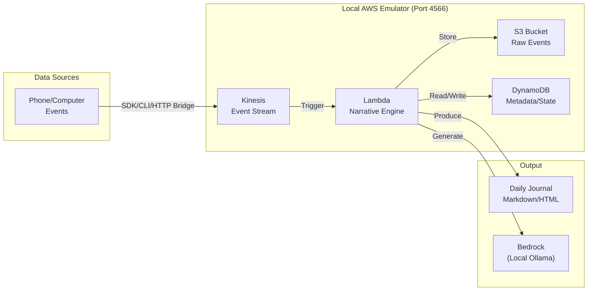

# Personal Narrative Engine (work in progress)📖

> Transform your digital life into bedtime stories, micro-fiction, and daily journals

## ✨ What It Does

Your phone and computer generate thousands of digital footprints daily - photos, songs, messages, emails, calendar events. The Personal Narrative Engine turns this "digital exhaust" into personalized stories, journal entries, and micro-fiction.

**Example outputs:**
- *"Today you captured 3 photos of your cat at sunset, listened to 'Bohemian Rhapsody' twice, and received an email about weekend plans..."*
- *"The notification chimed at 2:17 PM. Another email from work, but hidden between the lines was an invitation to adventure..."*

## 🏗️ Architecture

## 📦 Core Components

| Component | Purpose | Technology |
|-----------|---------|------------|
| **aws_cmd.sh** | AWS CLI wrapper for emulator | Bash |
| **Event Publisher** | Send events to Kinesis | Python/boto3 |
| **HTTP Bridge** | Receive events from browsers/apps | Flask |
| **Desktop Watcher** | Monitor local file system | Python/watchdog |
| **Lambda Processor** | Generate narratives | Python |
| **Local LLM** | Story generation | Ollama |

## 📊 Data Flow

1. **Event Sources** → Phone, computer, browser, apps
2. **Ingestion** → HTTP Bridge or direct Kinesis
3. **Storage** → Raw events in S3 (`year/month/day/user/events.json`)
4. **Processing** → Lambda triggered every 5 seconds or batch at day end
5. **State** → DynamoDB tracks processed events and user context
6. **Generation** → LLM creates narrative from day's events
7. **Output** → Markdown journal saved to S3 and local disk

## 🔐 Privacy & Security

- **Local-first**: All processing happens on your machine
- **No cloud dependency**: Works entirely offline with emulators
- **Data ownership**: Your narrative data never leaves your computer
- **Opt-in monitoring**: Each data source requires explicit enablement
- **PII filtering**: Email addresses, locations, and sensitive data can be hashed